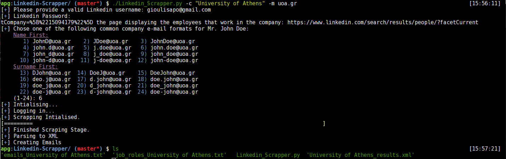

# Linkedin-Scrapper
## Description
This script is to be used when a list of all the possible employee emails is required. Provided the url, a valid linkedin username and password, the program will return two .txt files
* One that includes possible emails of the employees of the company under investigation.
* One that returns the names, and job roles of the of the employees of the company under investigation.
## Requirements
### Packages
* Debian  : `sudo apt-get install python3-setuptools phantomjs; sudo easy_install3 pip;`
* Arch  : `sudo pacman -S python-setuptools python-pip phantomjs; yaourt -S geckodriver; pacman -S phantomjs`
* Windows : You do it...
### Python libraries
* Selenium for python3
`sudo pip3 install -U selenium`
* lxml bs4
`sudo pip3 install -U lxml; sudo pip3 install -U bs4`
* requests
`sudo pip3 install -U requests`
# Usage

